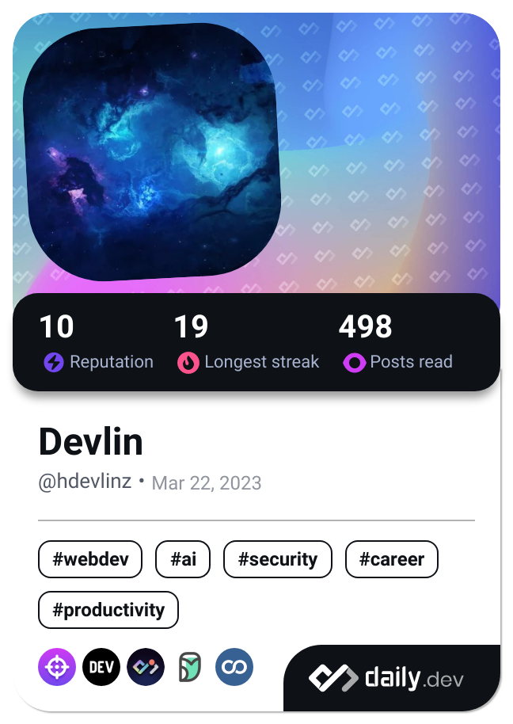

<!-- Header -->

---

<!-- Dev Card /\/\ https://github.com/HiepThanhTran/HiepThanhTran/blob/master/devcard.svg -->

 

<!-- Description -->
### 🔰 About me 🔰
- 👋 Hi, I'm Tran Thanh Hiep, but you can also call me **Devlin**
- 🎓 I'm studying at Ho Chi Minh City Open University
- 📚 I’m currently learning **Software Developer** by self
- 📫 This is my email [hiepthanhtran.2003@gmail.com](mailto:hiepthanhtran.2003@gmail.com)

<!-- Technologies -->
### ⚡ Languages and Tools ⚡

  

<!-- c,cpp,cs,dotnet,java,kotlin,py,mysql,html,css,js,jquery,sass,bootstrap,regex,git,github,heroku,vercel,githubactions -->

 

